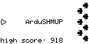
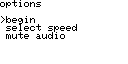
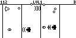
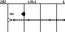
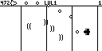
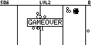

# ArduSHMUP

*ArdoBoy Shoot-Em-Up*

| | | |
|-------------------------|-------------------------|-------------------------|
|  |  |  |
|  |  |  |

## installing

To install on arduboy:

```
platformio run -t upload
```

For now requires platformio to build which means Linux or OSX. Will make something compatible with Arduino IDE some time in the future. 

## gameplay

### In-Game Keys

- `UP` `DOWN` `LEFT` `RIGHT`: move the ship
- `A`: fire a auxiliary weapon
- `B`: select weapon menu
	- `B` + `UP`: rotate previous weapon
	- `B` + `DOWN`: rotate next weapon

### Startup Keys

- `UP`: Flashlight mode
- `DOWN`: Enable screen mirroring
- `LEFT`: Clear high score


Score on the upper left, HP on the upper right, difficulty level in the upper center.