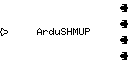
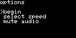
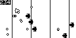
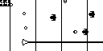
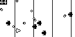
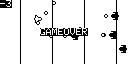

# ArduSHMUP

*ArdoBoy Shoot-Em-Up*

<kbd></kbd>
<kbd></kbd>
<kbd></kbd>

<kbd></kbd>
<kbd></kbd>
<kbd></kbd>

## installing

To install on arduboy:

```
platformio run -t upload
```

For now requires platformio to build which means Linux or OSX. Will make something compatible with Arduino IDE some time in the future. 

## gameplay

- `UP` `DOWN` `LEFT` `RIGHT`: move the ship
- `A`: fire a bullet
- `B`: fire a beam

Each enemy bullet shot down increases your score by `1`.  Each enemy ship shot down increases it by `10`.  Beam use costs `50` points, and beam will be unavailable if at least `50` points are not available.

Each time you are hit your score is reduced by `100`. If your score becomes negative, the game is over.